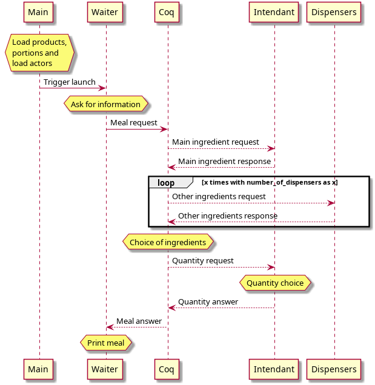

 # Gastro 

This is the project to be delivered as part of the INFOM451 Mobile Application Design course. 

### Requirements

- Java 8 JDK
- Scala
- Sbt

### Getting started

```bash
cd app
sbt run
```


### Documentation

> See the report for more

